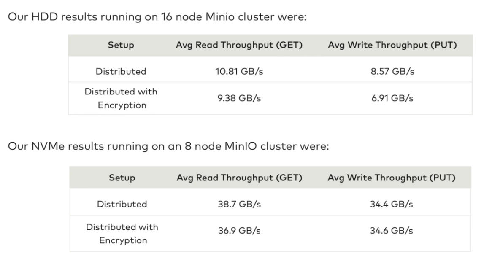
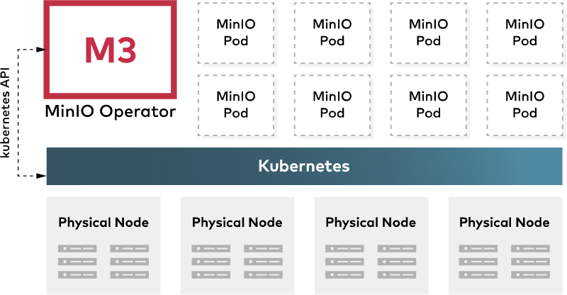

#### 1.  简述

#### 1.1 介绍

```
构建高性能的云原生数据
机器学习，大数据分析，海量存储的基础架构
MinIO 支持各种应用程序数据工作负载
在中国：阿里巴巴、腾讯、百度、中国联通、华为、中国移动等等9000多家企业也都在使用 MinIO 产品
```

- ###### 高性能

  

  

- ###### 可扩展

  

  

- ###### 云原生支持

  

  

- ###### 与 Amazon S3 兼容

#### 1.2 概念

- Object: 存储到 Minio 的基本对象。如文本、图片、视频、字节流、Anything...
- Bucket: 用来存储 Object 的逻辑空间，每个 Bucket 之间数据是相互隔离的。可以理解为顶层目录。
- Drive: 数据存储的磁盘。Minio 中所有的 Object 都会存储在 Drive/Bucket 下。
- Set：一组 Drive 的集合。分布式部署会根据集群下 Drive 总数，自动划分为一个或多个 Set，每个 Set 中的 Drive 分布在不同位置，一个 Object 存储在一个 Set 上。

#### 1.3 纠删码

```
MinIO 使用纠删码来校验和保护数据免受硬件故障和静默数据损坏（Bit Rot）。使用最高级别的冗余，即使丢失多达一半 (N/2) 的驱动器，但仍然能够恢复数据。

默认情况下，MinIO 在 N/2 个数据和 N/2 个奇偶校验驱动器上对对象进行分片。即数据盘 ( DataDrives )和 冗余盘 ( ParityDrives ) 个数相同， 所以我们真正可用的存储空间，只有我们总空间的一半大小。

注意：当有效磁盘大于等于 N/2 时，仍可进行读取操作；有效磁盘大于 N/2 时，才能进行存储操作。
例如：集群总磁盘数为 16，坏盘 8 个时，仍能读取，但是不能存储新对象，须确保有效磁盘数大于 8，才能存储新对象。
```

#### 1.4 存储形式

#### 2. 部署

#### 3. 硬件


#### 4. [集成](https://min.io/product/integrations)

