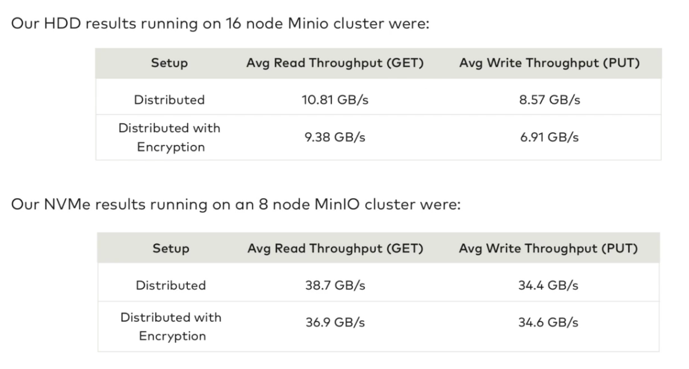
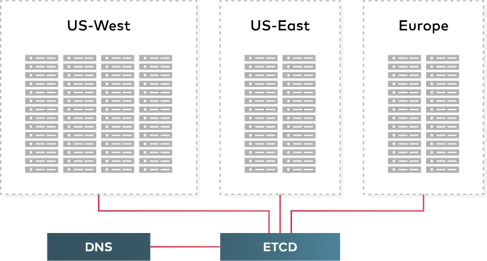
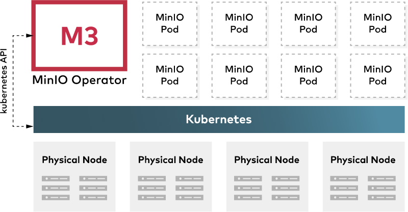
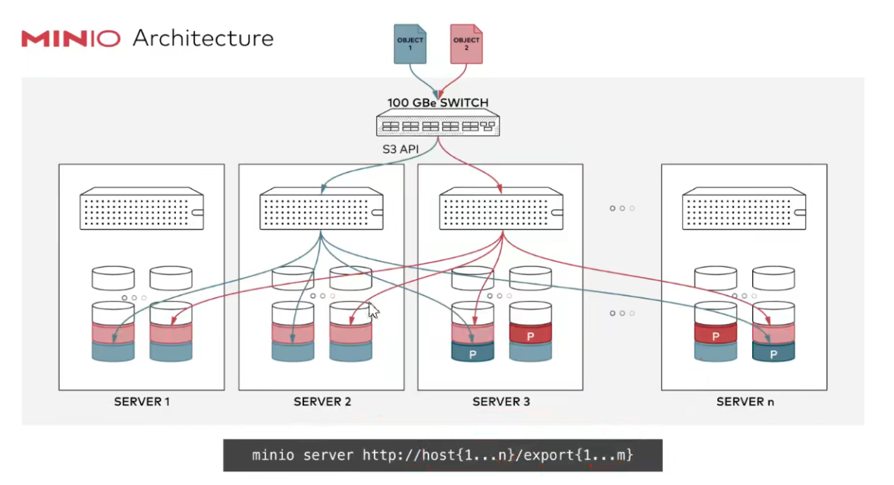
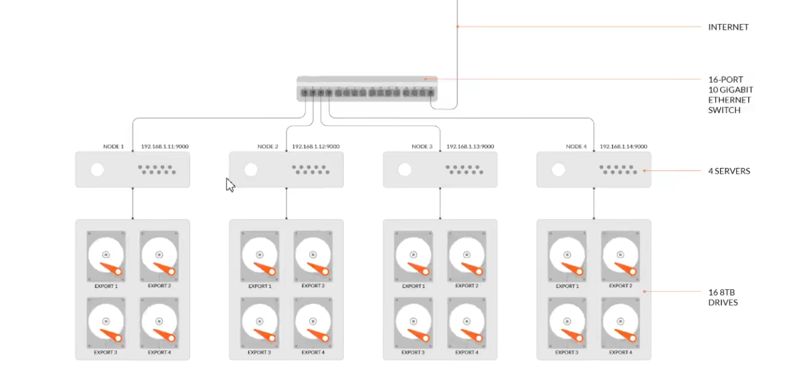
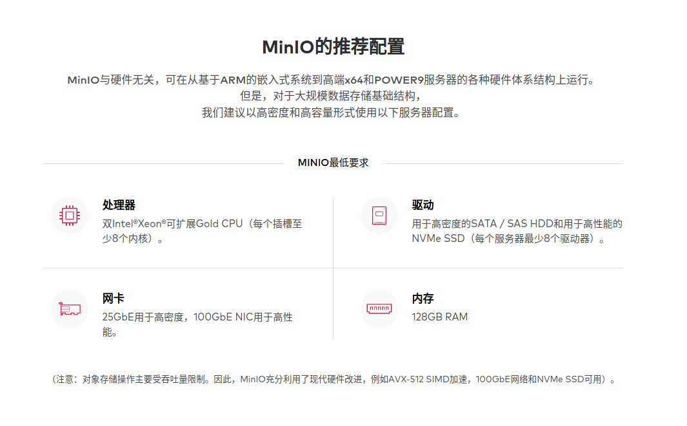
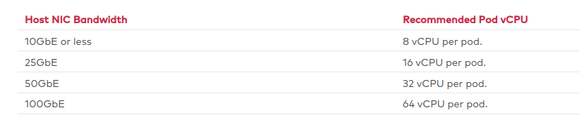
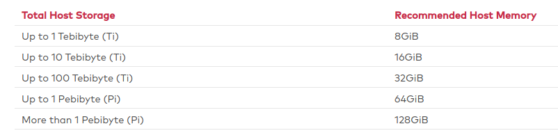
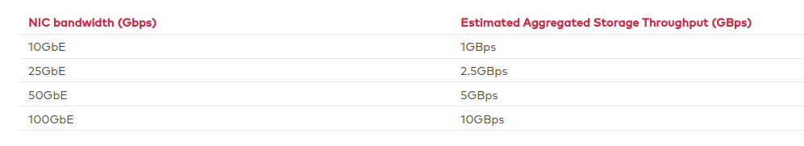

#### 1.  简述

##### 1.1 介绍

```
构建高性能的云原生数据
机器学习，大数据分析，海量存储的基础架构
MinIO 支持各种应用程序数据工作负载
在中国：阿里巴巴、腾讯、百度、中国联通、华为、中国移动等等9000多家企业也都在使用 MinIO 产品
```

- ###### 高性能

  

  

- ###### 可扩展

  

  

- ###### 云原生支持

  

  

- ###### 与 Amazon S3 兼容

##### 1.2 概念

- Object: 存储到 Minio 的基本对象。如文本、图片、视频、字节流、Anything...
- Bucket: 用来存储 Object 的逻辑空间，每个 Bucket 之间数据是相互隔离的。可以理解为顶层目录。
- Drive: 数据存储的磁盘。Minio 中所有的 Object 都会存储在 Drive/Bucket 下。
- Set：一组 Drive 的集合。分布式部署会根据集群下 Drive 总数，自动划分为一个或多个 Set，每个 Set 中的 Drive 分布在不同位置，一个 Object 存储在一个 Set 上。

##### 1.3 纠删码

```
MinIO 使用纠删码来校验和保护数据免受硬件故障和静默数据损坏（Bit Rot）。使用最高级别的冗余，即使丢失多达一半 (N/2) 的驱动器，但仍然能够恢复数据。

默认情况下，MinIO 在 N/2 个数据和 N/2 个奇偶校验驱动器上对对象进行分片。即数据盘 ( DataDrives )和 冗余盘 ( ParityDrives ) 个数相同， 所以我们真正可用的存储空间，只有我们总空间的一半大小。

注意：当有效磁盘大于等于 N/2 时，仍可进行读取操作；有效磁盘大于 N/2 时，才能进行存储操作。
例如：集群总磁盘数为 16，坏盘 8 个时，仍能读取，但是不能存储新对象，须确保有效磁盘数大于 8，才能存储新对象。
```

#### 2. 部署

##### 2.1 磁盘

- MinIO 强烈建议使用 `XFS` 格式磁盘的直接连接 `JBOD` 阵列以获得最佳性能。

  - 与网络存储（NAS、SAN、NFS）相比，直连存储 (DAS) 具有显着的性能和一致性优势。
  - 使用非 XFS 文件系统（ext4、btrfs、zfs）的部署往往性能较低，同时表现出意外或不受欢迎的行为。
  - RAID 或类似技术在与d分布式 MinIO 部署一起使用时不会提供额外的弹性或可用性优势，并且通常会降低系统性能。

- 确保部署中的所有节点使用具有相同容量（例如 N TB）的相同类型（NVMe、SSD 或 HDD）驱动器。 MinIO 不区分驱动器类型，也不受益于混合存储类型。此外。 MinIO 将每个磁盘使用的大小限制为部署中的最小驱动器。例如，如果部署有 15 个 10TB 磁盘和 1 个 1TB 磁盘，MinIO 将每个磁盘的容量限制为 1TB。

- MinIO 强烈建议使用`/etc/fstab`或类似的基于文件的挂载配置，以确保重启后驱动器顺序不会改变。例如：

  ```shell
  $ mkfs.xfs /dev/sdb -L DISK1
  $ mkfs.xfs /dev/sdc -L DISK2
  $ mkfs.xfs /dev/sdd -L DISK3
  $ mkfs.xfs /dev/sde -L DISK4
  
  $ nano /etc/fstab
  
    # <file system>  <mount point>  <type>  <options>         <dump>  <pass>
    LABEL=DISK1        /mnt/disk1         xfs     defaults,noatime        0             2
    LABEL=DISK2        /mnt/disk2         xfs     defaults,noatime        0             2
    LABEL=DISK3        /mnt/disk3         xfs     defaults,noatime        0             2
    LABEL=DISK4        /mnt/disk4         xfs     defaults,noatime        0             2
  ```

- ###### 网络文件系统卷破坏一致性保证

  ```
  MinIO 严格的 read-after-write 和 list-after-write 一致性模型需要本地磁盘文件系统。
  
  如果底层存储卷是 NFS 或类似的网络附加存储卷，MinIO 无法提供一致性保证。
  
  对于需要使用网络附加存储的部署，请使用 NFSv4 以获得最佳效果。
  ```

##### 2.2 分布式集群

```
  分布式 MinIO 可以让你将多块硬盘（甚至在不同的机器上、或不同机房的机器）组成一个对象存储服务（OSS，Object Storage Service）。由于硬盘分布在不同的节点上，分布式 MinIO 避免了单点故障。
```



```
minio server http://host{1...4}/export{1...4}

等价于：

minio server http://host1/export1 http://host1/export2  http://host1/export3 http://host1/export4
             http://host2/export1 http://host2/export2  http://host2/export3 http://host2/export4
             http://host3/export1 http://host3/export2  http://host3/export3 http://host3/export4
             http://host4/export1 http://host4/export2  http://host4/export3 http://host4/export4     
```

- ###### 分布式部署可靠性的常用方法

  ```
      分布式存储，很关键的点在于数据的可靠性，即保证数据的完整，不丢失、不损坏。只有在可靠性实现的前提下，才有了追求一致性、高可用、高性能的基础。而对于存储领域，一般对于保证数据可靠性的方法主要有两类，一类是冗余法，一类是校验法。
  ```

  - ###### 冗余

    ​    即对存储的数据进行副本备份，当数据出现丢失、损坏。即可使用备份内容恢复，而副本备份的多少，决定了数据可靠的高低。这其中会有成本的考量，副本数据越多，数据越可靠，但同时磁盘利用率越低。可靠性是允许丢失其中一份数据。当前已有很多分布式系统是采用此种方式实现，如 Hadoop 的文件系统 （3个副本）、Redis 集群、MySQL 的主从模式等。

  - ###### 校验

    ​    校验法即通过校验码的数学计算方式，对出现丢失、损坏的数据进行校验、还原。注意，这里有两个作用，一个校验，通过对数据进行校验和（checksum）计算，可以检查数据是否完整，有无损坏或更改，在数据传输和保存时经常用到，如 TCP 协议；二是回复还原，通过对数据结合校验码，通过数学计算，还原丢失或损坏的数据，可以在保证数据可靠性的前提下，降低冗余，如单机硬盘存储中的 RAID 技术、纠删码（Erasure Code）等。

- ###### 分布式 MinIO 的优势

  - ###### 数据保护

    分布式 MinIO 采用纠删码来防范多个节点宕机和位衰减 bit rot。

    分布式 MinIO 至少需要4个硬盘，使用分布式 MinIO 自动引入了纠删码功能。

    | 服务器数 | 每个服务器的最小驱动器数 |
    | -------- | ------------------------ |
    | 2        | 2                        |
    | 3        | 2                        |
    | 4        | 1                        |

  - ###### 高可用

    ​    单机 MinIO 服务存在单点故障，相反，如果是一个有 N 块硬盘的分布式 MinIO，只要有 N/2 硬盘在线，你的数据就是安全的。不过你需要至少有 N/2+1 个硬盘来创建新的对象。

  - ###### 一致性

    ​    MinIO 在分布式和单机模式下，所有读写操作都严格遵守 read-after-write（先写后读） 一致性模型。

- ###### 运行分布式 MinIO

  ​    启动一个分布式 MinIO 实例，只需要把硬盘位置作为参数传给 ```minio server``` 命令即可，然后，需要在所有其他节点运行同样的命令。

  - 分布式 MinIO 里所有的节点需要同样的```MINIO_ROOT_USER```和 ```MINIO_ROOT_PASSWD```，这样节点才能建立联接。为了实现这个，你需要在执行 ```minio server```之前，先将 ```MINIO_ROOT_USER``` 和 ```MINIO_ROOT_PASSWD``` 设为环境变量
  - 分布式 MinIO 使用的磁盘里必须是干净的，里面没有数据。
  - 分布式 MinIO 里的节点时间差不能超过 3 秒，可以使用 NTP 来保证时间一致。


示例：4节点，每节点4块盘

```shell
export MINIO_ROOT_USER=minio
export MINIO_ROOT_PASSWD=minioadmin
minio server http://192.168.1.11/export1 http://192.168.1.11/export2 http://192.168.1.11/export3 http://192.168.1.11/export4
             http://192.168.1.12/export1 http://192.168.1.12/export2 http://192.168.1.12/export3 http://192.168.1.12/export4
             http://192.168.1.13/export1 http://192.168.1.13/export2 http://192.168.1.13/export3 http://192.168.1.13/export4
             http://192.168.1.14/export1 http://192.168.1.14/export2 http://192.168.1.14/export3 http://192.168.1.14/export4
```




##### 2.3 扩展分布式集群（多集群）

```text
  添加新的服务器池需要同时重启部署中的所有 MinIO 节点。

   MinIO 强烈建议同时重启所有节点。 MinIO 操作是原子的并且是严格一致的。因此，重新启动过程不会中断应用程序和正在进行的操作。

   不要执行“滚动”（例如一次一个节点）重新启动。
  
   更新任何负载均衡器、反向代理或其他网络控制平面，以将客户端请求路由到 MinIO 分布式部署中的新主机。虽然 MinIO 在内部自动管理路由，但让控制平面处理初始连接管理可能会减少网络跃点并提高效率。
```

例如我们是通过区的方式启动 MinIO 集群：

```shell
export MINIO_ROOT_USER=minio
export MINIO_ROOT_PASSWD=minioadmin

minio server http://host{1...32}/export{1...32}
```

MinIO 支持通过命令，指定新的集群来扩展现有集群（纠删码模式）：

```shell
export MINIO_ROOT_USER=minio
export MINIO_ROOT_PASSWD=minioadmin

minio server http://host{1...32}/export{1...32} http://host{33...64}/export{1...32}
```

现在整个集群就扩展了 1024 个磁盘，总磁盘变为 2048，新的对象上传请求会自动分配到最少使用的集群上。通过以上扩展策略，就可以进行集群扩展。重新配置后重启集群，会立即在集群中生效，并对现有集群无影响。如上命令中，我们可以吧原来的集群看作一个区，新增集群看作另一个区，新对象按每个区域中的可用空间比例放置在区域中，基于确定性哈希算法确定位置

```
说明：添加的每个区域必须具有与原始区域相同的磁盘数量（纠删码集 SLA）大小，以便维持相同的数据冗余。

例如：第一个区有8个磁盘，可以将集群扩展为16个、32个或1024个，只需要确保部署的 SLA 是原始区域的倍数即可。
```

##### 2.4 硬件故障恢复

- ###### 驱动器故障 

  ```MinIO 支持用新的健康驱动器热交换故障驱动器。```

- ###### 节点故障

  ```MinIO 检测节点何时重新加入部署，并在节点重新加入之前存储在该节点上的集群修复数据后不久开始主动修复该节点。```

#### 3. 硬件



##### 3.1 CPU

​	MinIO 可以在消费级处理器上运行良好。 MinIO 可以利用支持 AVX-512 SIMD 指令的 CPU 来提高某些操作的性能。

​	MinIO 受益于根据每个主机的预期网络吞吐量分配 CPU。下表提供了根据主机支持的总网络带宽分配 CPU 以供使用的一般准则：



##### 3.2 Memory

​	MinIO 受益于根据每个主机的总存储分配内存。下表提供了根据主机上的本地存储总量分配内存以供 MinIO 服务器进程使用的一般准则:



##### 3.3 Networking

​	MinIO 建议使用高速网络来支持附加存储（聚合驱动器、存储控制器和 PCIe 总线）的最大可能吞吐量。下表提供了给定 NIC 支持的最大存储吞吐量的一般准则：



#### 4. [集成](https://min.io/product/integrations)

#### 5. [纠删码计算器](https://min.io/product/erasure-code-calculator)
